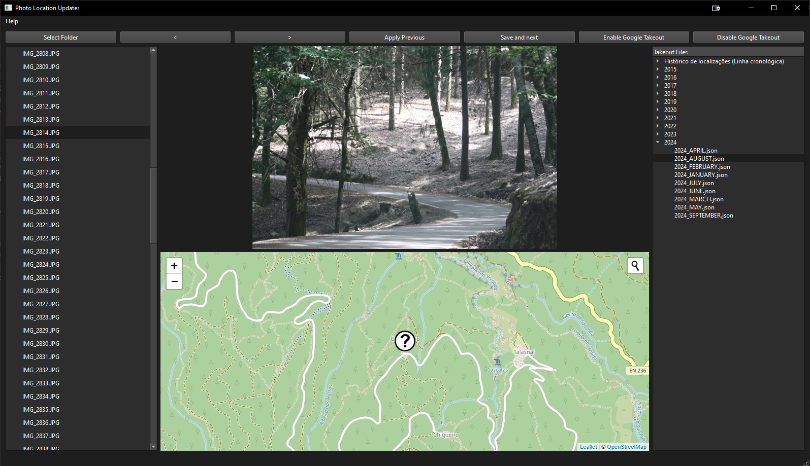

# Photo Location Updater
A simple tool to seamlessly update the geolocation metadata of your photos using an intuitive map-based interface. Whether you need to correct or add location data, this app makes it easy.


## Warning

**Important:** This tool results in data modification. It is highly recommended that a data backup be performed before executing the script. The script's author is not responsible for any data loss or damage that may occur during the execution of this script.

## Features
- 📂 Select a folder containing photos
- 🌍 View and update photo geolocation on an interactive map
- 💾 Save updated metadata easily





## App Execution 

There are two ways to run the app.

1. By download the executable and run it directly on your system. **Important:** that the windows could say the app is unverified.

2. By downloading this repository and run it from the source code.


## Execution with .exe

1. Download the executable file from the [Releases](https://github.com/Rick45/photo-location-updater/releases) tab.

2. Extracto to your desired folder **Important:** you need to extract all the content(both EXE and folder).

3. Run the "Photo Location Updater.exe" file


## Execution by source code

### Requirements

- Python 3.6+

## Installation (via source)
1. Clone the repository:
    ```bash
    git clone https://github.com/Rick45/photo-location-updater.git
    ```
2. Create a virtual environment:
    ```bash
    python -m venv venv
    source venv/bin/activate  # On macOS/Linux
    venv\Scripts\activate     # On Windows
    ```
3. Install dependencies:
    ```bash
    pip install -r requirements.txt
    ```

4. Run the app:
    ```bash
    python main.py
    ```

## App Usage

1. Use the GUI to select a folder containing photos.

2. Select a photo from the list to view its current geolocation.

3. Click on the map to update the geolocation of the selected photo.

4. Save the updated geolocation metadata to the photo.


## Acknowledgements

This project would not have been possible without the OpenStreetMap:

- [OpenStreetMap](https://www.openstreetmap.org/)


## Thanks
[](https://www.buymeacoffee.com/rick45)
